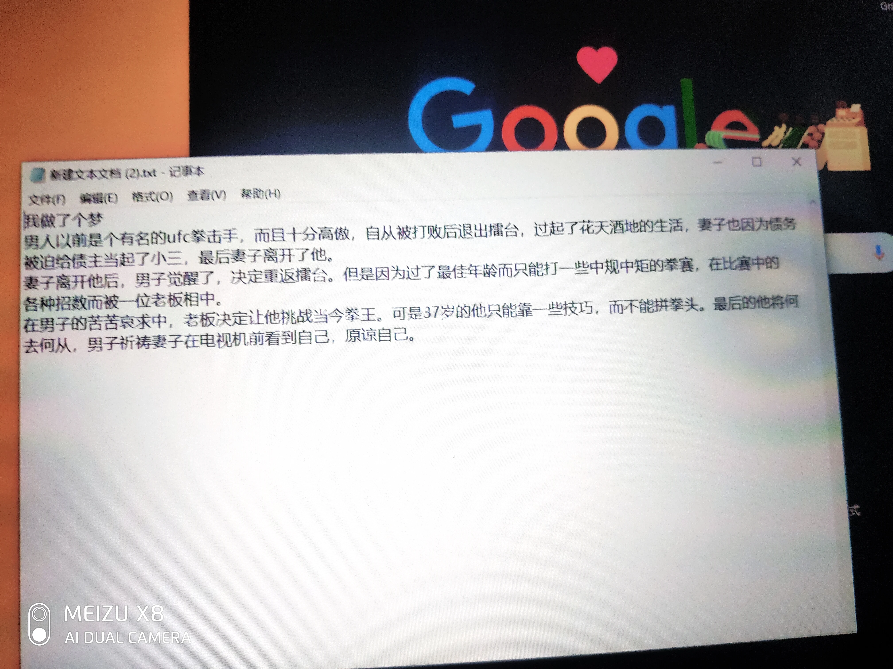

- 修罗传：阿修罗，迪洛克，寻利威，罗米修，格兰特，摩杰多，九龙，欧阳枫，宗政，勾婴，罗兰，史家栋，无双，塞隆，青冢名，小城，
- 阿修罗后传：亚伦紫，维纳斯蓝，杰弗瑞灰，西蒙橙
- 童年之梦：小男孩，无形灵魂
- 穿越剧：丹尼，劳埃德，杰西卡，弗兰克，艾薇拉
- 另一个地球：人与龙的前世今生
- 青蛇后传：裴成德，小青，小白（蛇），白素贞，许宣，贞童，吕洞宾
- 中土世界：他，梅
   一个作家从美国回到土耳其，去参加父亲的葬礼。葬礼过后，年迈的母亲和他讲起了金融大街上的雕像。那个作家听到过关于他的许多版本，早已疲倦，正如耸立20年的雕像。为了不扫老母亲的兴，听她讲起了关于他的故事……
- 我的母亲原来是由土耳其派往伊拉克的军医，他是伊朗的士兵。他们在战争中结识。没过多久土耳其撤兵，但是由于交通要道被敌军堵死，
- 爱神：丘比特，普赛克，阿波罗，维纳斯
- 重返归途：我，
- 
- 淹没2099：
-
- #灵感
-