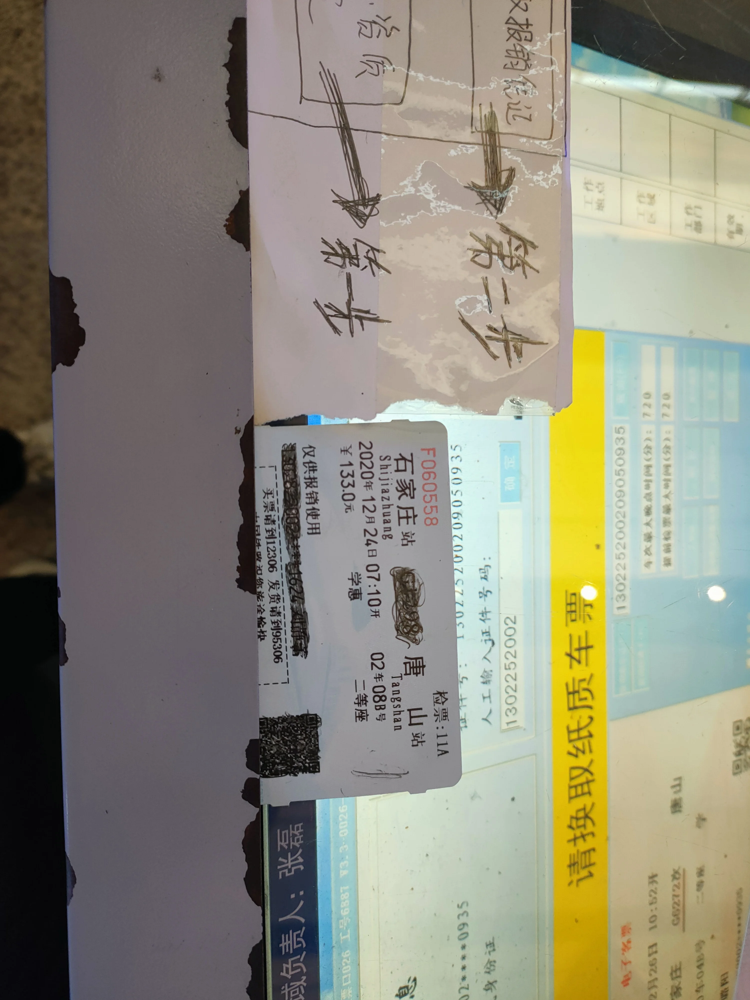
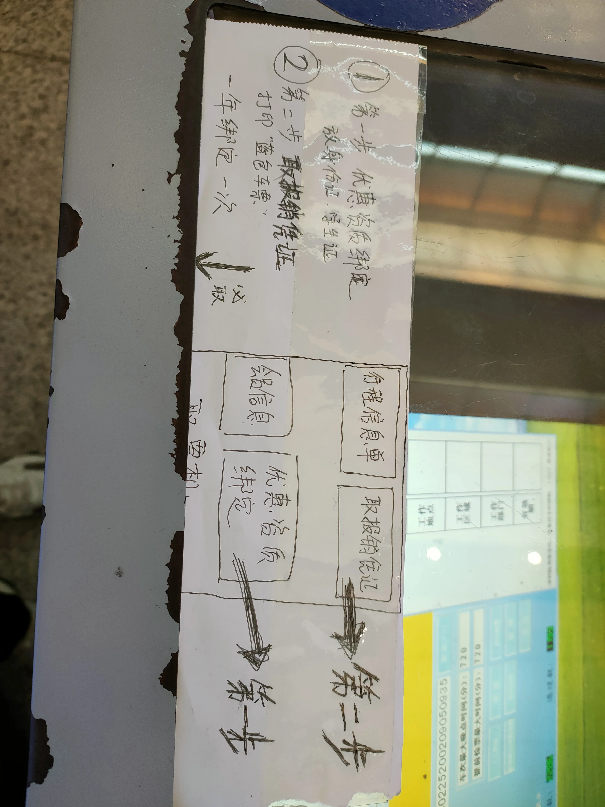

- ## 地铁
- 1. 打开手机地图搜索地铁，查找最近的地铁口（分为A、B、C）
- 2. 提前在手机钱包中存好零钱，然后用NFC通过地铁站
- 3. 进入地铁后寻找售票机进行购买，查找目的地在那条路线上。比如我在一号线，目的地是二号线，只需要点击二号线的目的地即可
  4. 贴卡进站后寻找对应路线，一般有双向的地铁，需要查看牌子或柱子辨别列车方向
- 5. 出站是插卡出站，如果警告补票，寻找服务台进行补票，需要提前带好零钱
-
- ## 高铁
- 1. 在出发日前10~15天进行买票，微信(优先)、携程、12306进行购买
- 2. 买学生票要准备学生证，然后前往车站售票机进行绑定（一年绑定一次）
  
- 
- 3. 进站后看大屏幕，选择候车室候车（科普一下:C城际列车<200，D是动车200，G高铁200-300，K快旅客列车120，T特快旅客列车140，Z直达旅客列车160，仅数字绿皮车100）
- 4. 基本上车半小时前开始检票，检票口分为如15A|15B检票口，检票口上面的电子荧幕上会有显示具体列车前往哪里检票
- 5. 寻找车厢和座位号，行李箱有专门的行李柜(不要鲁莽的往上放)
-
- ## 飞机
- 1. 下载指定的航司app，然后买票
- 2. 提前24小时在app上值机选座，不用在机场打印机票了
- 3. 如有需要请到指定的人工柜台办理托运，免费托运20kg以下(超额后很贵，不建议)
- 4. 不要携带100mm的液体、打火机等易燃物品、易拉罐等易爆物品，电子产品放包里，充电宝最多一万毫安
- 5. 提前两个小时到达机场(可以坐机场巴士到达机场)，过门口安检
- 6. 走指定航司的安检，然后接受非常仔细的检查，包括拿出手机、电脑、充电宝和外套
- 7. 寻找登机口，然后检票上飞机
- 8. 飞机起飞前手机打开飞行模式，系好安全带
- 9. 飞机的上升|下降都会造成耳膜肿胀，请张哇
-
- ## 预定酒店
- 1. 酒店集团电话
- 2. 酒店位置(查看周遭环境，上次去北京血的教训)
- 3. 酒店品牌
- 4. 房间类型(大床房、双人床……)
- 5. 住宿日期(几号入住、住几宿)
- 6. 有无早餐 价格及会员卡
-
- ## 闲鱼
- 1. 不包邮(小件写好非质量问题不退不换不包邮)
- 2. 全方位介绍自己的产品(缺点外观之类的，灰常重要)
- 3. 确定心里价位(比如你的产品想卖3000，你挂3388，买家小刀到3200，发过去后再刀到3000)
- 4. 小心买家和你玩文字游戏(只在闲鱼上聊，只用闲鱼交易，不要vx)
- 5. 确认买家地址
- 6. 发货用顺丰，谈好收货时间间隔
- 7. 保留证据(发货前拍好外观，机器运作情况等等，对一些零件用笔打好标记，以防被换件。在顺丰录好机器正常以及装货的视频)
- 8. 闲鱼交流时要客气，但不要退缩 切记闲鱼电子产品区都是骗子(斗智斗勇吧亲！)
- 9. https://sspai.com/post/64206
-
- #其他