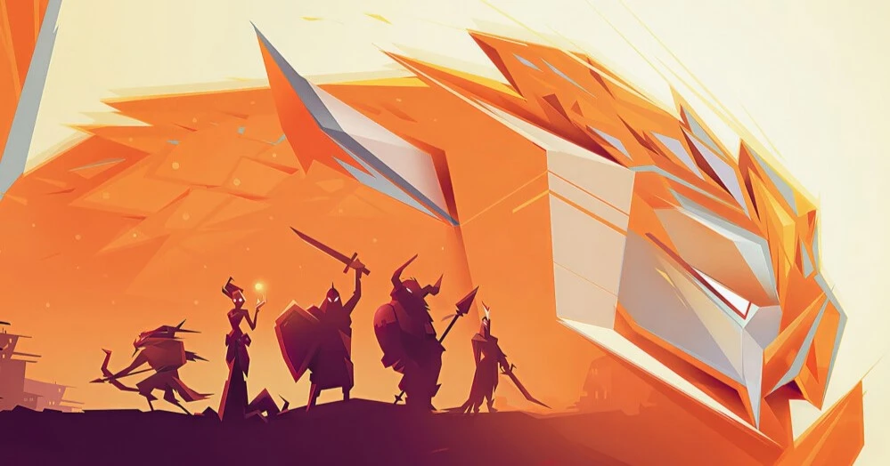

- # 佛教
  
  印度佛教三相神(女):梵天，毗湿奴，湿婆
  
  六道轮回:生死善恶的因果
  
  佛有六道:天道，人道，畜生道，饿鬼道，地狱道，修罗道
  
  三恶:畜生道(愚昧，忠厚)，饿鬼道(贪念，生存)，地狱道(怨恨，希望，执著)一切众生造作恶业而生其处。
  
  三善:修罗道(攀比，斗法)，人间道(苦难，修静，解脱)，天人道(虚伪，包容)
  
  身：不杀生、偷盗、邪淫。口：不恶口、妄言、绮语、两舌。意：不贪、瞋、痴。
  
  对于阿修罗来说，一切都是孽。
  
  宋朝覆灭，阿修罗出生在战火地区，从小受尽人间苦楚，饥不择食。
  
  母亲的癫狂和父亲的软弱无能造就他情绪无常的状态，欺父怕母的性格。
  
  宋朝的余党一直寻找皇后，想要扶植皇子东山再起。一天村里贴出告示，图片上正是阿修罗的母亲。父亲跑到官府声称告示上正是我的妻子。此时母亲正卧病在床，容颜犹在。一时间阿修罗家里风光无二，村里人都尊称圣上。但等来的不是父亲的封官厚禄，而是全村被屠杀。
  
  十字军接到消息先到一步，此消息正被村子里嫉妒的某些人传到十字军手中的。双标的村里人把母亲抬到广场上被十字军强奸至死。
  
  在树林里，阿修罗和少爷们正玩弄着为了食物而献身的小女孩。
  
  刚从死里逃生的父亲带走了阿修罗，因为他是高官厚禄的唯一筹码。
  
  等回到村子的时候，之前的那些少爷们灰头土脸地正在废墟中装作可怜地祈求好心人的收留。那些刚刚到来的"好心人"打听那个女人的踪迹，村里侥幸活着的人全部闭口不言了。有一位姐姐向阿修罗询问那个女人的下落，阿修罗说她死了，被你们害死的。
  
  那些“好心人”对着死缠烂打的村里人说:我们会给予你们帮助的。然后就离开了。那些人正是宋朝余党。
  
  阿修罗代表的是东方的命运与轮回
  
  寻利威代表的是南方的自由与涅槃
  
  迪洛克代表的是西方的制衡
- # 迪罗克
  
  迪洛克想要与阿修罗联手统一整个东西方。一辈人有一辈人要完成的使命，第一代卡洛斯的离去使世界分裂成东西方，再然后群雄逐鹿掀起无休止的战争。本来半世纪前在塞隆与魔冲组成的同盟下可以吞并东方，再度统一。可伴随着魔冲被暗杀，艾皇的出现，战争被匆匆结束，但烂摊子留给了咱们。
  
  现在这个世界的主宰是先知，要想把他们踹下皇椅就要切断他们与世界的联系，除掉蝠阁。
  
  等到吞并了周边各国，我不会与你瓜分世界，而是拼个你死我活。赢的人会成为新时代的主宰，被写入史书中，成为既卡洛斯艾皇之后第三个被世人所铭记的人。
# 六号

由于阿修罗到了西方，在此的蝠阁手下六号受命于保护阿修罗，那时她刚刚15岁。

一开始阿修罗由于是个坏孩子，处处被六号所排挤。那时的六号是他们这些孩子的组长(年龄大)，那个部队的纪律性是很高的。

在得知保护阿修罗时，她会奋不顾身的保护他。阿修罗搞坏事时，她会包庇他。

阿修罗加入的部队被打败后，他们逃亡(六号和他一起逃亡的，有剧情)到了格兰特的领地，以打工者的身份加入了格兰特联盟的分支。

慢慢的越来越多蝠阁的人暗中加入了这里，秘密保护阿修罗，这才在之后的格兰特联盟中跨越式飞升(因为格兰特的丈夫也是蝠阁的人)。

六号会有后续的

阿修罗与寻利威在打九龙之前就分开了。他俩追寻的东西都不一样，阿修罗追寻的是权利，迪洛克追寻的是尊重(被人看得起)，寻利威追寻的是自由。

阿修罗在东方陷阵杀敌，迪洛克在西方摸爬滚打，寻利威则是经受洗礼(一个个在他身边发生的离奇故事让他理解了世界，也以主角身份揭开了南方的谜团)

怎么加入的蝙蝠阁下:她的父亲是蝠阁的人，她被安排在这个部队接受历练。但偶然间阿修罗来到了这里，承担了保护阿修罗的职责。

在那个战乱纷争的时代，根本无法顾及爱情，更不用说被当成提线木偶的阿修罗了。很多女人为他抛出过橄榄枝，六号暧昧的问候，罗兰与他在月光下畅谈。赛晔为了他拒绝了迪洛克，塞隆更是想让塞宋两家结姻。但最后阿修罗给赛晔砍了，塞隆大发雷霆，迪洛克的如意算盘彻底结束，气的迪洛克抢了塞隆手下的兵，最后被追杀。
-
- # 剧情
- 艾皇征服了全世界，为人类赢得了公平。他们走后新的艾皇
- 
- 杰克(兽人弓箭手)、赛纳斯(未知魔法师)、牛头(兽人副手)、缪尔(人类副手)、艾皇(不在此图，很丑陋)
- 
- 爱丽丝、路西法
- 寻利威的身世未知，但他有个诅咒，兽形会随着时间不断变大，人形正常成长。不断变大的兽形会使他越来越笨拙、艰难，直到死亡。所以从小上帝就为他开启了倒计时。
- 阿修罗的世界被毁灭过很多次，也被创造了很多次。一旦世界平衡被打乱，那它也就离死亡不远了。就像我们生活在地球，地球毁灭了，所有人都活不成。一个世界毁灭，另一个世界诞生，同时也诞生了先知。先知们一直维系着新世界的平衡，一晃几千年，直到未知的南方出现了新的生物。
- 渐渐地平衡被一股神秘力量打破，东西方魔兽异军突起，发起了无止境的暴乱。身为先知们直系的后羿月光族浮出水面，一夜间刺杀了所有暴乱发起者。
- 但是屠龙勇士终将成为了恶龙，由于先知们一味的纵容他们，导致西方世界陷入了无休止的恐慌，大大小小的战争一直持续了半个世纪。西方北部发生了一起很平常的暴乱，一个男人将一百个月光族的人头挂在了城墙之上，一时间所有蠢蠢欲动的势力揭竿而起，魔兽与月光的战争爆发了。
- 心灰意冷的先知们关上了通往神界的大门，魔族获得了最终的胜利。但是又一轮新的屠杀开始了，魔兽们贴出公告悬赏月光族的人头、耳朵或肢体，走投无路的月光族最终跑到了中西方交界处开始了新的生活。
- 这个处在漩涡的英雄就是第一代大魔王卡洛斯，他为魔兽重新获得了地位和领地，也是唯一一个被先知所尊重的魔兽。
- 大魔王走后旧部的统治地位持续走低，新的势力包括九龙、赛迦、魔冲、艾皇、等等势力，西方面临了新的大洗牌。
- 东方也没闲着，东方唯一一个超级大国的国王去世，国王的妃子作为陪葬，他的儿子迎娶了勾婴(相当于勾婴的儿子成为了她的丈夫)。
- 九龙为继承卡洛斯的意志，帮助了被逼上绝境的旧部，开疆扩土，最后公开与先知作对。赛迦和魔冲借助时代的狂潮打造了自己的帝国，开始窥视古老的东方国度。
- 宋朝的国君昏庸无道，不问世事，沉迷女色和怪文，甚至想推倒那十二颗神柱。大臣们开始各自为政、勾心斗角，政坛一片混乱，百姓生活更是苦不堪言。黑十字的前身是帮助先帝打天下的各路诸侯，先帝为制衡他们把十字军分成了黑十字和白十字，白十字是由全国挑选出的精英、月光族的后裔、皇帝的直系亲属组成的强大军队。一场又一场的暴乱接踵而至，勾婴无奈亲自操盘，白十字进入诸侯领地直取项首，杀鸡儆猴一展皇威。
- 赛迦和魔冲联合宋朝的周边小国入侵宋朝，国内也是暴乱不止，内忧外患的宋朝节节败退，勾婴在此期间从白十字中少数人成立了东龙。一年后宋朝失去了一半的领土，联合军队将要发起最后的进攻。
- 进攻前夕塞隆绑架了自己的哥哥赛洪，以此要挟父亲。没想到一个出生在宋朝北部的小国的人类，一夜间暗杀了魔冲。为此计划失败同盟破裂，赛迦心生畏惧没有进攻，吞并了已有的领地，最后塞隆被打入地牢。黑十字率领反叛者血洗皇城，以国王为首的一些部下为掩护皇后们战死到最后一刻。
- 魔冲一死他的侄子魔杰多率领军队最终定居到了最西方边界的冰雪山崖，几年后艾皇终结了西方的混战，塞隆在与父亲的权利棋盘中夺取了统治地位，定居在了中世界。白十字几年的卧薪尝胆，勾婴带着她的孩子回到白十字重掌政权，整顿全国上下，收复失地，辅佐宗政为他以后铺路。世界迎来短暂的和平。西方势力有中部的九龙，西部的魔杰多，北部的卡洛特和，中世界的赛隆帝国和周世界。
- 大魔王和先知达成和解，带上了他忠实的部下去了南方
- (魔兽与月光的战争其实特别艰难，民众们既不会帮助月光，更不会帮助魔兽。而月光的后盾是先知，所以卡洛斯发起的战争是节节败退，直到坚持到先知关上了月光族的后门，终结了五年混战)
- (先知们一方面是偏心，他们是我的后羿，我需要他们帮我消除隐患和维系和平;另一方面是无暇顾及这些生灵，先知们也有他们的棋盘)
- (月光族胜利之后，开始在古老的东方安营扎寨。北方的一
- 股势力和月光族结盟，吞并了各个国家，成立了宋朝。皇帝为了防止月光族异心，在边界树立了十二个神柱，渐渐地在宋朝以内都没有了魔法，所以第二次战争只爆发在了西方)
- (十字军分为黑十字和白十字;蝠阁的前身是东龙，聚集了众多高手。黑十字反叛的时候勾婴为保留实力把东龙差遣到世界各地，为宋朝复盘做打算。在此期间东龙渐渐为先知做事，几年后辅佐勾婴登上了历史舞台。东龙一边为勾婴做事，一边在世界各地招收人手，一边为先知做事。在勾婴被打入冷宫期间将东龙改为蝠阁，为了赢得先知们的信任更是把实际控制权交给了先知)
- 艾皇其实一直爱慕着勾婴，在勾婴逃出皇城那几年，艾皇帮助了她。
- 寻利威来头不简单:卡洛特的得力干将，与阿修罗、迪洛克为三兄弟，魔杰多的六位鸟人之一，蝠阁的部下。
- 世界上最神秘的传说，移动的亚特兰蒂斯号。它的城堡在船上航行，比先知还要古老，唯一一个不被毁灭的东西。它行踪不定，有的人说只是个古老的传说，有的人说他真的见过。阿修罗在码头偷偷上去的那艘船正是亚特兰蒂斯号，仿佛命中注定中，这个十一岁的孩子得到了阿修罗，无尽的轮回，开始了。
- 阿修罗并不是一个人，而是某种不存在的东西，
- 比如我和王璐阳融合在一起，假如我和王璐阳这个身份分开的话，王璐阳这个身份有他的名字、身份证号、电话号码、账号等等。而我不过是一个躯体、只有身高体重血缘这些参数。你可以把我安上别的身份，比如段浩文这个身份，他有我这个躯体段浩文可以更容易被女孩子所接受。
- 所以阿修罗可以无尽轮回，拥有不同的人生，他已经不是他了，但阿修罗永远是阿修罗。
- 第一代是大魔王卡洛斯的那个时代
- 第二代是艾皇的那个时代
- 第三代是阿修罗的那个时代
-
- # 其他
- 一位老僧告诉他：阿修罗，你去西方吧，切记，不要回来（他将来会在西方把西方绞地天翻地覆，但是单挑九龙，而后被部下反叛而七窍流血。蝠阁连夜缝补他的肉身，以心中的蛇丸来抑制他的实力，因为肉身崩坏会直接暴走没。蝠阁规劝他抛弃西方的一切去东方当皇帝）
- 如果他没有来东方，格兰特帝国也不会被迪洛克霸占。
- 在东方他退居二线，渐渐挫失了锐气，一代阿修罗，就此湮灭与历史中。东方宋朝渐渐衰败，西方的霸主已是迪洛克（但由于从福阁背叛得来的地盘，战争不可避免），请求阿修罗联手颠覆这个世界。但阿修罗拒绝了，迪洛克被迫采取防御措施，一年后被暗杀。
-
- #创作